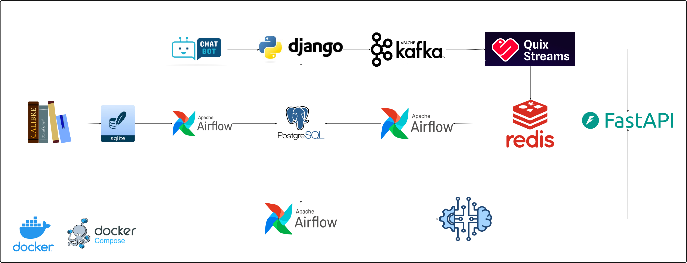
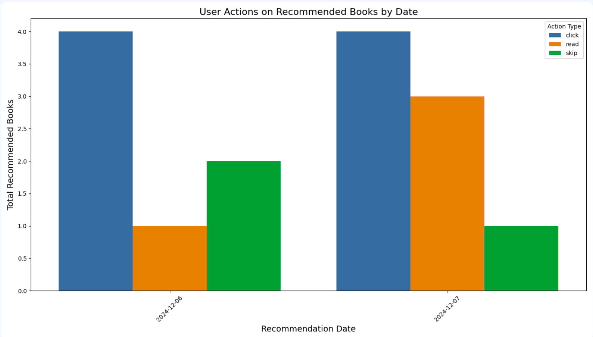

# **Hệ thống thư viện cộng đồng thông minh**
## **Giới thiệu**
Dự án xây dựng một hệ thống thư viện thông minh, cung cấp nền tảng web để người dùng tương tác với kho sách, đồng thời triển khai chatbot tư vấn sách theo yêu cầu của người dùng sử dụng kỹ thuật Retrieval-Augmented Generation (RAG). Hệ thống khuyến nghị sách thời gian thực được phát triển dựa trên các tương tác của người dùng, sử dụng thuật toán học tăng cường REINFORCE. Ngoài ra, dự án còn xây dựng một data warehouse phục vụ việc đánh giá hiệu quả của mô hình thông qua phản hồi của người dùng. Tất cả các thành phần trong dự án đều được đóng gói trong Docker và được quản lý bởi Docker Compose, đồng thời được điều phối và tự động hóa bởi Apache Airflow, bao gồm việc chuyển dữ liệu, tự động đọc/ghi dữ liệu và huấn luyện lại mô hình sau một khoảng thời gian định kỳ.
## **Kiến Trúc Tổng Quan**

**1. Calibre**: Quản lý và tổ chức dữ liệu sách 

**2. SQLite**: Cơ sở dữ liệu của Calibre

**3. PostgreSQL**: Cơ sở dữ liệu chính của hệ thống, bảo quản dài hạn.

**4. Redis**: Lưu trữ cache tạm thời

**5. FastAPI**: Cung cấp API gọi đến mô hình khuyến nghị

**6. Apache Kafka**: Gửi và nhận dữ liệu tương tác của người dùng realtime

**7. Quix Stream**: Xử lý dữ liệu streaming từ Kafka.

**8. Django**: Frontent & Backend

**9. Apache Airflow**: Quản lý và orchestration cho các nhiệm vụ ETL, huấn luyện mô hình
## **Chi tiết các thành phần trong hệ thống**
### **1. Thành phần chuyển dữ liệu từ calibre vào cơ sở dữ liệu chính của hệ thống**

*Chi tiết  hoạt động*

*Ngoài ra còn khởi tạo các bảng trong cơ sở dữ liệu chính nếu chưa tồn tại*

### **2. Thành phần chatbot tư vấn sách**

*Chi tiết  hoạt động*

### **3. Thành phần xử lý dữ liệu streaming từ tương tác người dùng và khuyến nghị theo thời gian thực**

*Chi tiết  hoạt động*

### **4. Thành phần đọc dữ liệu cache từ redis vào postgres, tiền huấn huấn luyện và cập nhật mô hình khi có dữ liệu mới**

*Chi tiết  hoạt động*

- **Pretraining pharase:** Áp dụng Contrastive Learning sử dụng Triplet Loss để học biểu diễn các embedding của các quyển sách tốt hơn, mục tiêu mong muốn các quyển sách có cùng thể loại sẽ gom nhóm lại gần nhau hơn trong latent space, cùng với đó là giảm chiều embedding để mô hình khuyến nghị không bị quá phức tạp.

- **Training RecSys Model**: Mô hình sẽ tự động huấn luyện lại trên dữ liệu mới và một phần dữ liệu cũ, sử dụng lại các trọng số của lần huấn luyện gần nhất. Mô hình áp dụng thuật toán REINFORCE trong học tăng cường, thuộc loại policy gradient để huấn luyện cùng với lớp mã hóa trạng thái người dùng từ lịch sử tương tác gần nhất.
### **5.Kho dữ liệu và trực quan hóa**

*Chi tiết  hoạt động*

Dữ liệu lịch sử tương tác, khuyến nghị của của dùng sẽ được ETL đến kho dữ liệu để phục vụ cho việc phân tích, cụ thể là phân tích độ hiểu quả của mô hình khuyến nghị dựa trên phản hồi của người dùng trên những quyển sách được hệ thống gợi ý.

