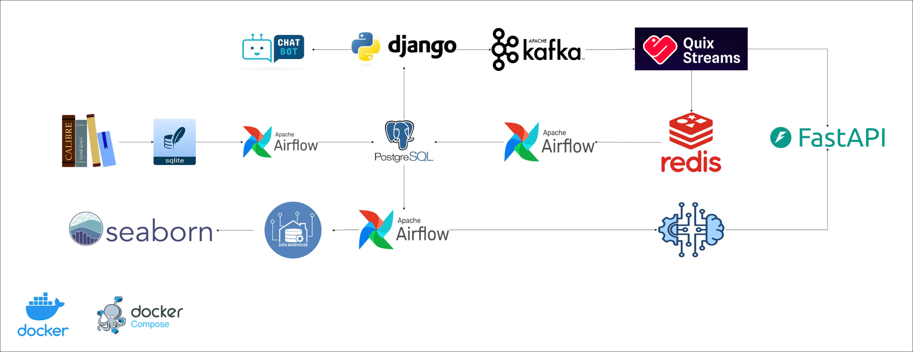
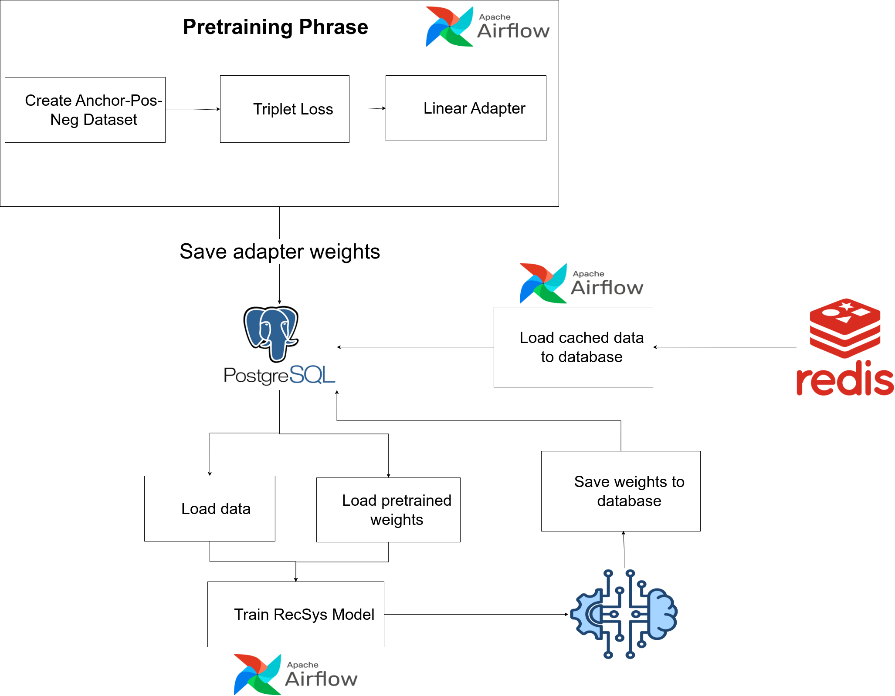
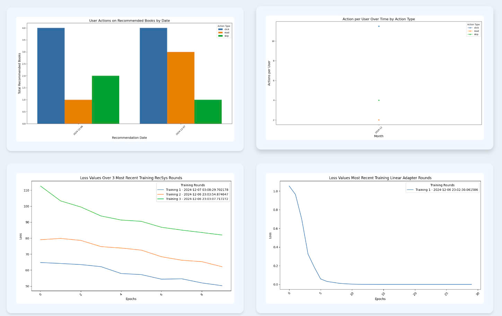

# **SMART PUBLIC LIBRARY SYSTEM**
## **Introduction**
The project aims to build a smart public library system that provides a web platform for users to interact with a book repository. It also integrates a chatbot for book recommendations based on user requests, leveraging the Retrieval-Augmented Generation (RAG) technique. A real-time book recommendation system is developed using user interactions, employing the REINFORCE reinforcement learning algorithm. Additionally, the project includes the development of a data warehouse to evaluate the model's effectiveness through user feedback. All components of the project are containerized using Docker and managed with Docker Compose. The workflow is orchestrated and automated using Apache Airflow, covering tasks such as data transfer, automatic data reading/writing, and periodic model retraining.
## **Overview Architecture**

**1. Calibre**: Manages and organizes book data.

**2. SQLite**: Database for Calibre.

**3. PostgreSQL**: The primary database for long-term storage.

**4. Redis**: Temporary cache storage.

**5. FastAPI**: Provides APIs for the recommendation model.

**6. Apache Kafka**: Streams real-time user interaction data.

**7. Quix Stream**: Processes streaming data from Kafka.

**8. Django**: Backend and frontend development.

**9. Apache Airflow**:Manages and orchestrates ETL tasks, model training.
## **Detailed Components of the System**
### **1. Data Transfer Component from Calibre to the Main Database**
<!--  -->

*Automates data extraction from Calibre and uploads it to the main database.*
*Initializes database tables if they do not exist.*

### **2. Chatbot for Book Recommendations**
<!--  -->

*The chatbot uses RAG techniques to provide recommendations tailored to user needs*
### **3. Real-Time User Interaction Data Processing and Recommendations**
<!--  -->

*Processes user interaction data streamed through Kafka. Generates real-time book recommendations.*
### **4. Data Handling from Redis to PostgreSQL, Pretraining, and Model Updating**
<!--  -->

- **Pretraining phase:** Utilizes Contrastive Learning with Triplet Loss to improve the representation of book embeddings. The goal is to cluster books of similar genres closer in latent space while reducing the embedding dimension to simplify the recommendation model.

- **Training the RecSys Model**: The model retrains automatically on new data along with a subset of old data. It reuses the weights from the latest training iteration. The model employs the REINFORCE reinforcement learning algorithm (a policy gradient method) combined with a user state encoder built from recent interaction history.

### **5.Data Warehouse and Visualization**
<!--  -->

*The interaction history and recommendation data are processed through ETL pipelines and stored in the data warehouse for analysis. Enables analysis of the recommendation model's effectiveness based on user feedback on suggested books.*

## **Demo**

